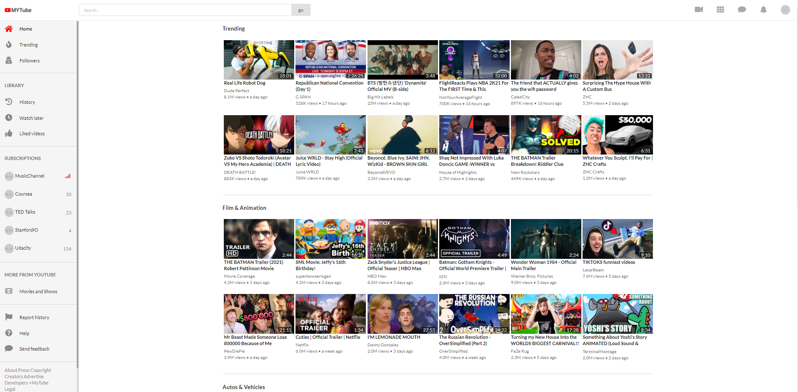

# Youtube Clone :arrow_forward:

### This project was built using advance React-Redux and JSx.
---
Languages used:
* JavaScript
* React
* Redux
* HTML5
* SCSS
---
### Youtube API V3 was also used to fetch videos, videoCategroies, comments for each video, relatedVideos and more..
---
#### Working components include a Home feed containing multiple categroies which their respective popular videos.
#### Once a video is clicked it will route you to a Watch component containing information towards its respective video.
---
#### Home Feed

---
#### Categories of video in Home Page (Trending Button directs you to Trending Videos)

---
#### Watch Video once clicked

---
#### Description of video (Comments, Channel Information)

---
